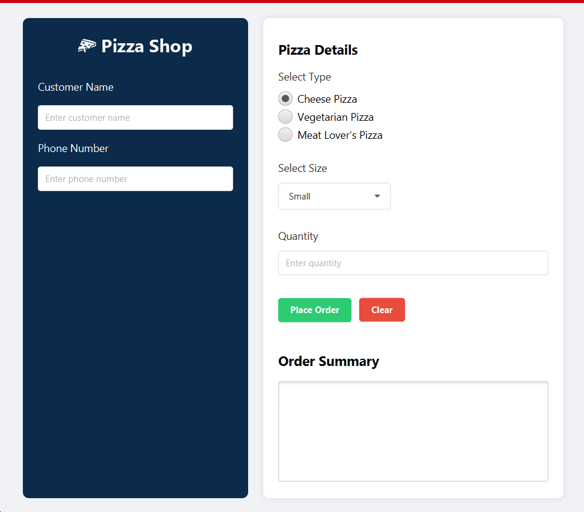
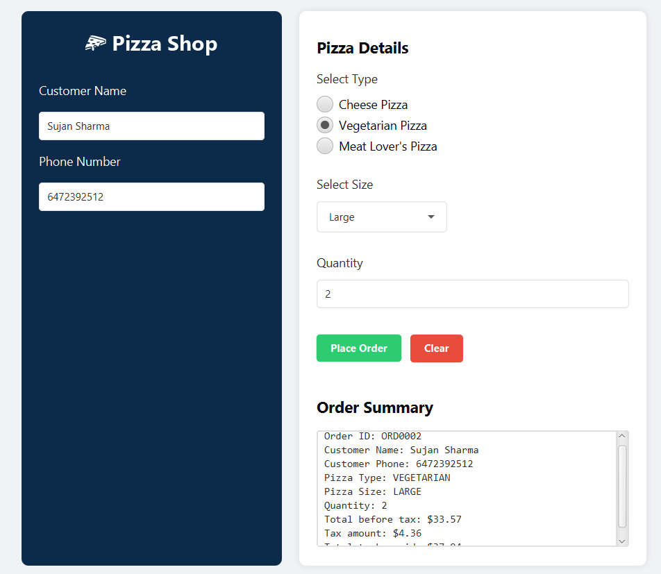

# 🍕 Pizza Shop Management System

A JavaFX-based desktop application for managing pizza orders. This elegant and user-friendly application helps pizza shop owners streamline their order management process with a modern interface and robust functionality.

## Features

### 🎯 Core Functionality
- Create and manage customer orders
- Support for multiple pizza types (Cheese, Vegetarian, Meat Lover's)
- Various pizza size options
- Real-time order summary generation
- Tax calculation
- Automatic order ID generation

### 💫 User Interface
- Modern, intuitive design
- Responsive layout
- Dark-themed customer information panel
- Clear order summary display
- Input validation
- User-friendly form controls

### 🛠 Technical Features
- MVC (Model-View-Controller) architecture
- Object-Oriented design principles
- Data validation
- Error handling
- Extensible codebase

## Prerequisites

- Java JDK 17 or higher
- Maven
- IDE (preferably IntelliJ IDEA)
- JavaFX SDK

## Installation

1. Clone the repository:
```bash
git clone https://github.com/notsujansharma/pizza-shop.git
```

2. Navigate to the project directory:
```bash
cd pizza-shop
```

3. Build the project using Maven:
```bash
mvn clean install
```

4. Run the application:
```bash
mvn javafx:run
```

## Project Structure

```
PizzaShop/
├── src/
│   ├── main/
│   │   ├── java/
│   │   │   ├── module-info.java
│   │   │   └── com/
│   │   │       └── pizzashop/
│   │   │           ├── Main.java
│   │   │           ├── controller/
│   │   │           │   └── PizzaOrderController.java
│   │   │           └── model/
│   │   │               ├── Customer.java
│   │   │               ├── Order.java
│   │   │               └── Pizza.java
│   │   └── resources/
│   │       └── com/
│   │           └── pizzashop/
│   │               └── view/
│   │                   ├── PizzaShop.fxml
│   │                   └── styles.css
└── pom.xml
```

## Usage

1. Launch the application
2. Enter customer details in the left panel
3. Select pizza type, size, and quantity in the right panel
4. Click "Place Order" to process the order
5. View the order summary in the text area
6. Use "Clear" to reset all fields for a new order

## Screenshots


*Main application interface with order form*


*Order summary with price calculation*

## Contributing

Contributions are welcome! Please feel free to submit a Pull Request.

1. Fork the project
2. Create your feature branch (`git checkout -b feature/AmazingFeature`)
3. Commit your changes (`git commit -m 'Add some AmazingFeature'`)
4. Push to the branch (`git push origin feature/AmazingFeature`)
5. Open a Pull Request

## License

This project is licensed under the MIT License - see the [LICENSE](LICENSE) file for details.

## Acknowledgments

- JavaFX framework
- Maven build tool
- Scene Builder for FXML design
- [Add any other libraries or tools you used]

## Contact

Project Link: [https://github.com/notsujansharma/pizza-shop](https://github.com/notsujansharma/pizza-shop)